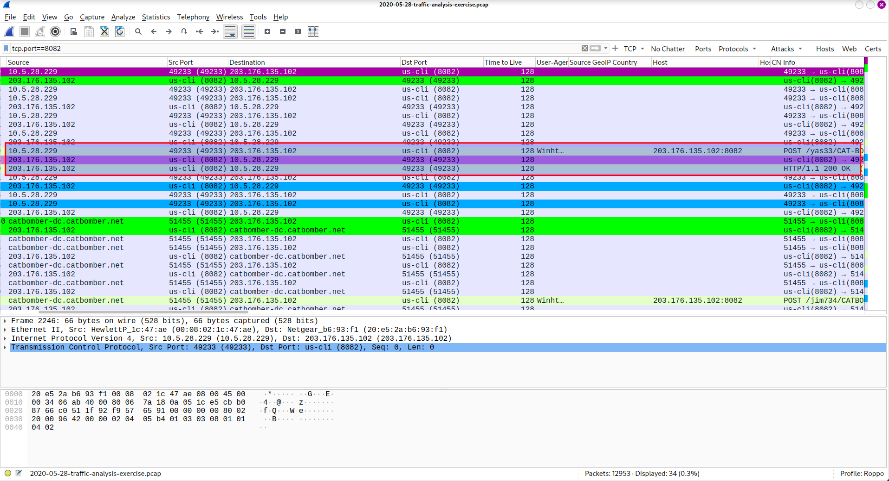

# About
A Malware traffic analysis exercise from a pcap posted on Malware-Traffic-Analysis.net on 2020-05-28 by Brad Duncan featuring Trickbot malware.

Link to exercise: https://www.malware-traffic-analysis.net/2020/05/28/index.html
## What is Trickbot?
Trickbot is a type of malware that primarily functions as a banking Trojan to steal sensitive financial information from infected systems that typically is distributed through malicious email attachments, phishing campaigns, exploit kits, or malvertising. While Trickbot initially focused solely on banking fraud, it has expanded its targets to include various industries such as finance, healthcare, manufacturing, and critical infrastructure since 2016. 

Read more about Trickbot: https://www.forbes.com/sites/leemathews/2019/07/14/stealthy-trickbot-malware-has-compromised-250-million-email-accounts-and-is-still-going-strong/?sh=22aa72e14884

Read more about identifying Trickbot network traffic: https://unit42.paloaltonetworks.com/wireshark-tutorial-examining-trickbot-infections/

# SCENARIO

LAN segment data:

    LAN segment range:  10.5.28.0/24 (10.5.28.0 through 10.5.28.255)
    Domain:  catbomber.net
    Domain controller:  10.5.28.8 - Catbomber-DC
    LAN segment gateway:  10.5.28.1
    LAN segment broadcast address:  10.5.28.255

 
# QUESTIONS

This month's pcap is a Trickbot infection in an Active Directory (AD) environment where the infection spreads to the Domain Controller (DC).

### Identify Trickbot related traffic
   According to Brad Duncan (Malware-Traffic-Analysis), the following activity found in the 2020-05-28 PCAP is common in Trickbot infections:
   
#### An IP address check by the infected Windows host

#### HTTPS/SSL/TLS traffic over TCP ports 447 and 449

#### HTTP traffic over TCP port 8082

#### HTTP requests ending in .png that return Windows executable files

   ### Based on the Trickbot infection's HTTP POST traffic, what is the IP address, host name, and user account name for the infected Windows client?
   IP Address: 10.5.28.229

   
   Host Name: Cat-Bomb-W7-PC

   
   User Account Name: phillip.ghent
   
  
   
   ### What is the other user account name and other Windows client host name found in the Trickbot HTTP POST traffic?

   
   ### What is the infected user's email password?
   
   
   ### Two Windows executable files are sent in the network traffic.  What are the SHA256 file hashes for these files?
   cursor.png - 4e76d73f3b303e481036ada80c2eeba8db2f306cbc9323748560843c80b2fed1
   imgpaper.png - 934c84524389ecfb3b1dfcb28f9697a2b52ea0ebcaa510469f0d2d9086bcc79a
   
   
   
   
   
   
   
   

 ### Acknowledgements
A Malware traffic analysis exercise from a pcap posted on Malware-Traffic-Analysis.net on 2020-05-28 by Brad Duncan.
