# About
A Malware traffic analysis exercise from a pcap posted on Malware-Traffic-Analysis.net on 2023-05-26 by Brad Duncan featuring IcedID malware.

Link to Brad Duncan's exercise archives: https://www.malware-traffic-analysis.net/
## What is IcedID?
IcedID is a sophisticated banking trojan that goes beyond traditional banking threats by incorporating features commonly found in information stealers and modular malware.

By performing web injection on browsers and acting as proxy to manipulate traffic, it steals sensitive financial information, login credentials, and other personal data from infected systems. It then sends that stolen information to a remote server.

IcedID is often distributed through phishing campaigns, malicious email attachments, exploit kits, or other social engineering techniques. Once a system is infected, IcedID establishes a foothold and begins its malicious activities.

Since 2017, IcedID has demonstrated a high degree of adaptability and evolution. It has been observed incorporating new features, updating its infection techniques, and adjusting its tactics to evade detection by security solutions. It is even sometimes used as a delivery mechanism for other malware, making it a part of larger and more complex cybercrime operations by threat groups such as TA551.

Given its adaptability and ongoing development, IcedID remains a concern for cybersecurity professionals, and its detection and mitigation require a combination of advanced threat intelligence, endpoint protection, and network security measures. Organizations should stay informed about the latest threats and adopt best practices to defend against evolving banking trojans like IcedID.

## MITRE ATT&CK IcedID & TA551 Threat Group References

For a deeper dive into TA551's use of IcedID, see [TA551: Email Attack Campaign Switches from Valak to IcedID](https://unit42.paloaltonetworks.com/ta551-shathak-icedid/)

## PCAP LAN Details 
- **LAN segment range**: 10.4.19[.]0/24 (10.4.19[.]1 through 10.4.19[.]255)
- **Domain**: boogienights[.]live
- **Active Directory Domain controller IP address**: 10.4.19[.]19
- **Active Directory Domain controller hostname**: WIN-GP4JHCK2JMV
- **LAN segment gateway**: 10.4.19[.]1
- **LAN segment broadcast address**: 10.4.19[.]255

## Exercise Questions
#### What is the date and time in UTC the infection started?
*Viewing endpoint statistics to look for any asymmetric traffic volume*

*Demonstrating the default values for certificate generation*
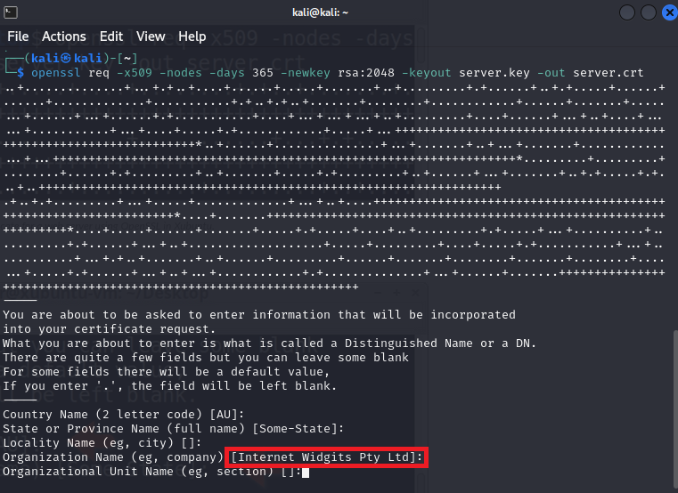
*Because many C2 botnet domains use self-signed certificates, I used a display filter packets containing "Internet Widgets Pty Ltd" (courtesy of Brad Duncan & Unit 42)*
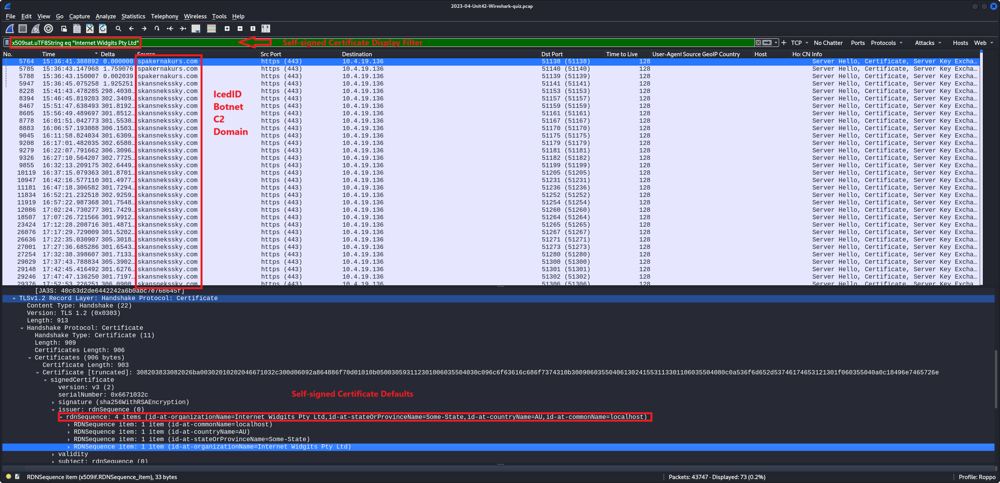
*Potential C2 botnet domain submitted to VirusTotal reveals it's relation to IcedID*
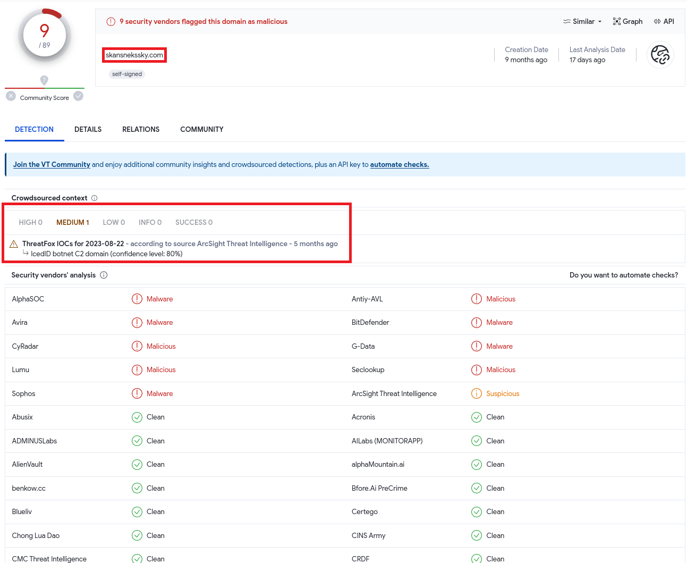
*The initial contact (unencrypted HTTP GET request typically generated by IcedID installers, possibly delivered by phishing with word docs containing malicious embedded macros)*
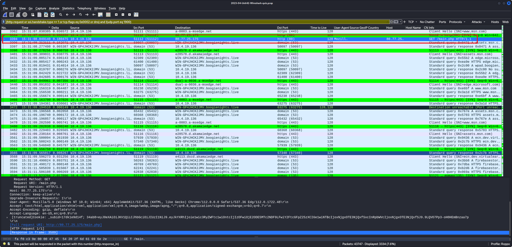
### MITRE ATT&CK Reference & Mitigation Measures

#### Mitgations: AV, NIPS, Block unknown attachments, Email Authentication Mechanisms, User Training 

#### Mitgations: User Traininig, Execution Prevention, Behavior Prevention on Endpoint
*Following the TCP stream reveals a redirect to the firebasestorage url seen below*

*firebasestorage url submitted to VirusTotal reveals malicious activity related to IcedID*
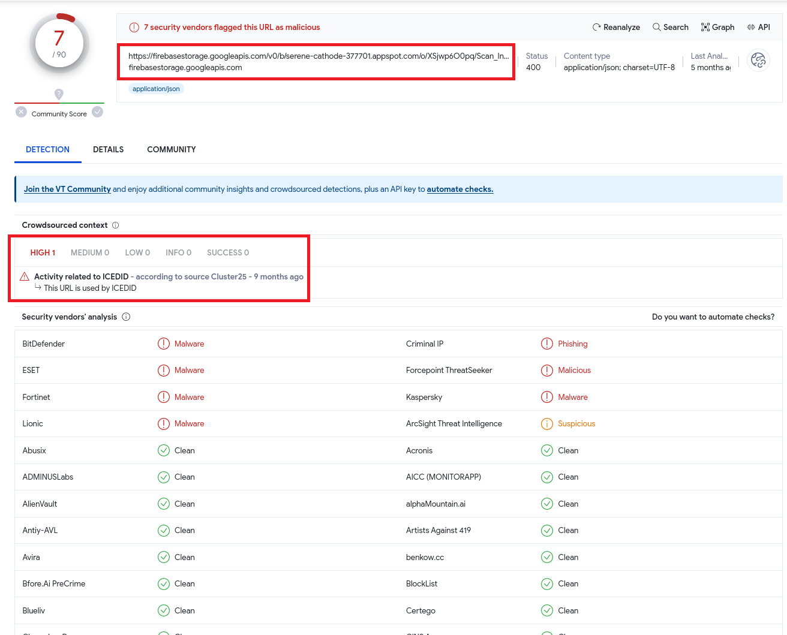

**What is the IP address, MAC address, hostname, and account name of the infected Windows client?**
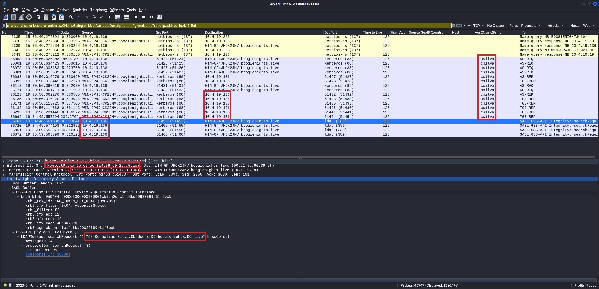

**Is there any follow-up activity from other malware?**

## Threat Intelligence
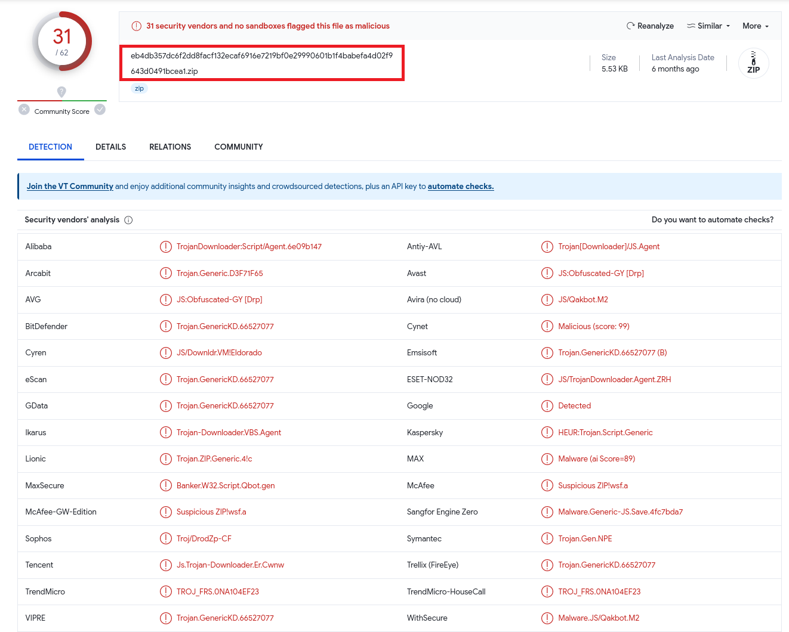

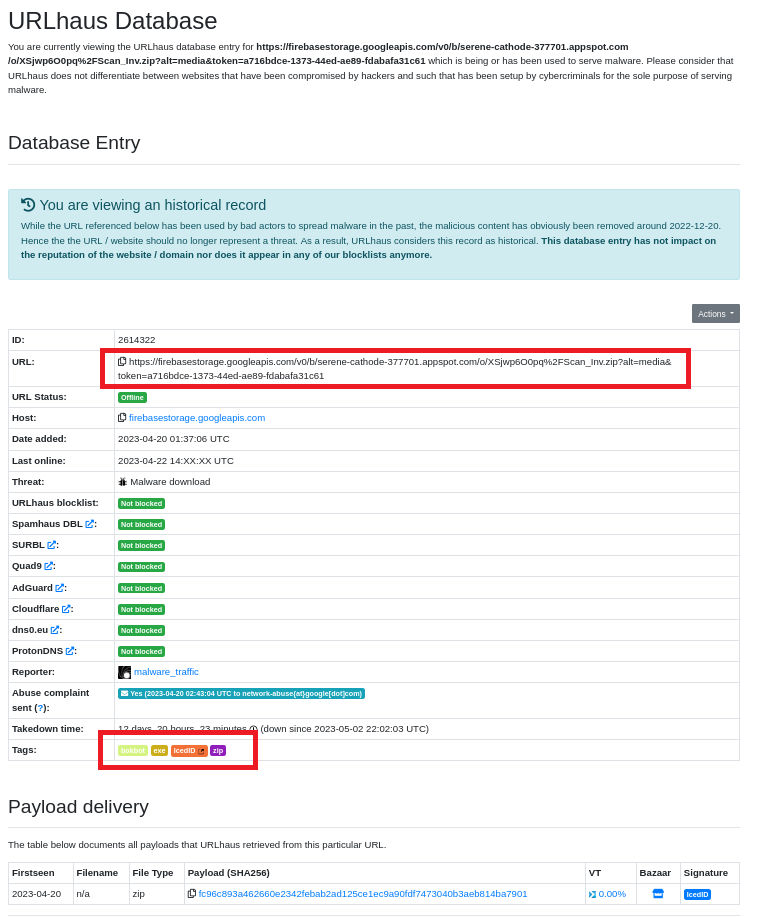

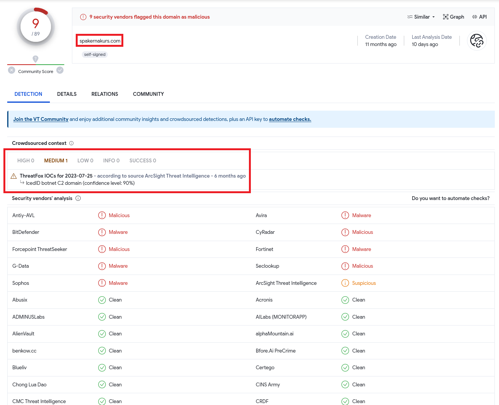

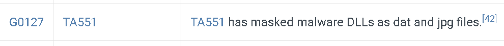

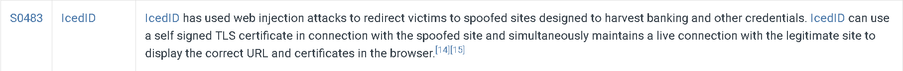

## Acknowledgements
To read more about this exercise, see [Cold as Ice: Unit 42 Wireshark Quiz for IcedID]([https://unit42.paloaltonetworks.com/ta551-shathak-icedid/](https://unit42.paloaltonetworks.com/wireshark-quiz-icedid/)https://unit42.paloaltonetworks.com/wireshark-quiz-icedid/)
