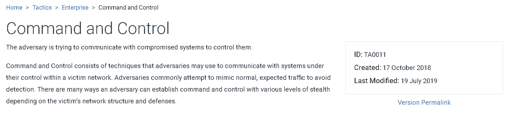
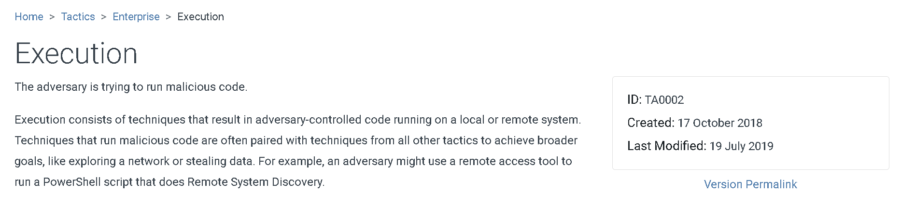
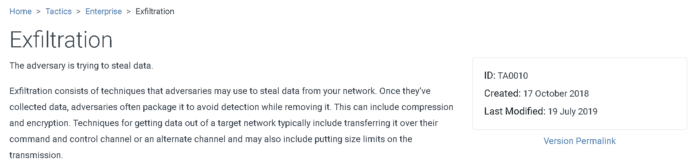
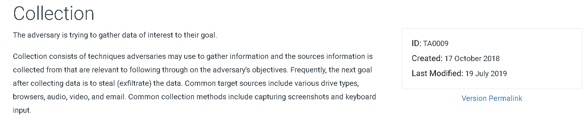

# Analyzing Redline-Stealer Malware Traffic with Security Onion

## About
A Malware traffic analysis exercise from a pcap posted on Malware-Traffic-Analysis.net in July 2023 by Brad Duncan (Unit 42) featuring Redline Stealer malware.

Link to Brad Duncan's exercise archives: https://www.malware-traffic-analysis.net/

## Tools Used
- Security Onion Console
- Network Miner
- Wireshark
- Mitre ATT&CK
- Virus Total
- URLHaus
- MalwareBazaar
- Suricata
- SHA256

### MITRE ATT&CK Redline Stealer & G1004 Threat Group References

## Incident Report

### Executive summary

On 2023-07-10 at 22:39 UTC, a Windows computer used by the user "rwalters" was infected with Redline-Stealer, a Windows-based malware categorized as an information stealer. It is designed to infiltrate systems covertly and exfiltrate sensitive information, including login credentials, cryptocurrency wallets, personal data, and other valuable information to remote command and control (C2) servers operated by threat actors. 

Following the infection of the victim host, an data exfiltration attempt was made to a remote C2 server including the folloiwng:

- Running Processes
- Hardware Specifications
- Files on the victim's desktop
- Files in the victim's Documents folder
- Login credentials from various web browsers
- User data for various  web browsers
- Data for several cryptocurrency wallets and the associated browser plugins 
- API keys

Due to the attempted data exfiltration, rwalters was instructed to change login credentials for all platforms, applications, and services included in the exfiltration attempt.
  
### Victim details

- Victim’s IP address: 10.7.10[.]47
- Victim’s MAC address: 80:86:5b:ab:1e:c4
- Victim’s Windows host name: DESKTOP-9PEA63H
- Victim’s Windows user account name: rwalters
###### Hosts tab in Network Miner displaying the victim's details 

### Indicators of compromise (IoCs)
#### IP Addresses, Ports, Domain names, URLs
- hxxp://623start[.]site/?status=start&av=
- hxxp://623start[.]site/?status=install
###### Security Onion Console TCP Stream displaying the antivirus being reported to the malicious domain 

###### Get request reporting the victim's antivirus status to the malicious domain

###### VirusTotal query for the malicious domain

###### VirusTotal query for the malicious IP

###### MITRE ATT&CK Tactic Associated With Malicious Activity 

- hxxp://guiatelefonos[.]com/data/czx.jpg
- hxxps://guiatelefonos[.]com/data/czx.jpg
###### Security Onion Console displaying certificate information for the malicious domain

###### Security Onion Console displaying the get request for the malicious file

###### URLHaus query for the malicious domain

###### VirusToal query for the malicious IP

###### VirusTotal query for the malicious domain

###### MITRE ATT&CK Tactic Associated With Malicious Activity 

- tcp://194.26.135[.]119:12432/
###### Security Onion Console displaying connections to the Redline C2 domain

###### Wireshark displaying the connection to the Redline C2 domain

###### Security Onion Console TCP Stream displaying the attempted data exfiltration

###### VirusToal query for the malicious IP

###### MITRE ATT&CK Tactic Associated With Malicious Activity 

#### Files
- SHA256 hash: 3c42b93801f02696487de64bb623f81cf7baf73a379a46e1459ca19ae7dc2454
- File size: 348,160 bytes
- File location: hxxps://guiatelefonos[.]com/data/czx.jpg
- File description: Windows executable file for RedLine Stealer
###### Network Miner diplaying the malicious file

###### Security Onion Console displaying the get request for the malicious file

###### MalwareBazaar entry for the malicious file

#### Suricata Alerts
###### Overview of Suricata alerts that fired 

###### Suricata Alert: Redline Stealer

###### Suricata Alert: net.tcp connection activity

###### Suricata Alert: Redline C2

###### Suricata Alert: Powershell User-Agent

###### Suricata Alert: Redline Stealer C2 Response
 

## Local Area Network (LAN) Details 
- LAN segment range: 10.7.10[.]0/24 (10.7.10[.]1 through 10.7.10[.]255)
- Domain: coolweathercoat[.]com
- Domain controller IP address: 10.7.10[.]9
- Domain controller hostname: WIN-S3WT6LGQFVX
- LAN segment gateway: 10.7.10[.]1
- LAN segment broadcast address: 10.7.10[.]255

## Exercise Questions

#### What is the date and time in UTC the infection started? 07-10-23 22:39 UTC
#### What is the IP address of the infected Windows client? 10.7.10[.]47
#### What is the MAC address of the infected Windows client? 80:86:5b:ab:1e:c4
#### What is the hostname of the infected Windows client? DESKTOP-9PEA63H
#### What is the user account name from the infected Windows host? rwalters
#### What type of information did this RedLine Stealer try to steal? *See Below*
###### TCP Stream displaying exfil of victim's directory data and data from various cryptocurrency wallets

###### TCP Stream displaying exfil of a screenshot of the victim's desktop

###### TCP Stream displaying victim's running processes and captured login credentials

###### Editing the hex values of the extracted file to reveal the .png screenshot taken by the threat actor

###### MITRE ATT&CK Tactic Associated With Malicious Activity 

#### Security Onion Console Dashboards
###### Security Onion Console Dashboard: PCAP Overview

###### Security Onion Console Dashboard: Connections Overview

###### Security Onion Console Dashboard: HTTP Overview

## Acknowledgements
For more information on this pcap, see [Crossing the Line: Unit 42 Wireshark Quiz for RedLine Stealer](https://unit42.paloaltonetworks.com/wireshark-quiz-redline-stealer/)
