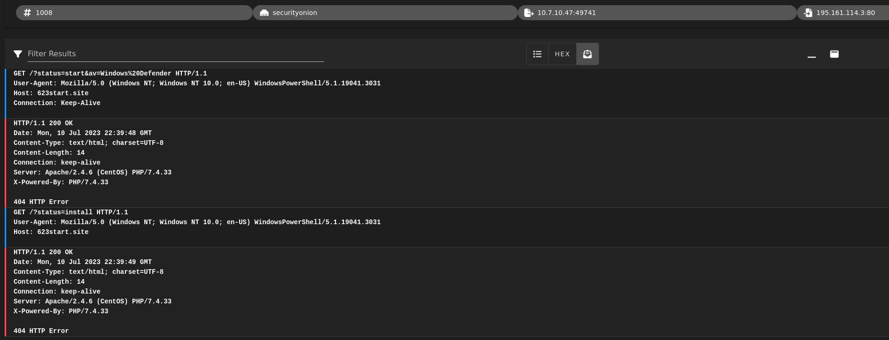

# About
A Malware traffic analysis exercise from a pcap posted on Malware-Traffic-Analysis.net in July 2023 by Brad Duncan featuring IcedID malware.

Link to Brad Duncan's exercise archives: https://www.malware-traffic-analysis.net/
## What is Redline Stealer?
IcedID is a sophisticated banking trojan (and likely successor to Dridex) designed to steal sensitive financial information, login credentials, and other personal data from infected systems. 

## MITRE ATT&CK IcedID & TA551 Threat Group References

For a deeper dive into TA551's use of IcedID, see [TA551: Email Attack Campaign Switches from Valak to IcedID](https://unit42.paloaltonetworks.com/ta551-shathak-icedid/)

## Incident Report
In this scenario, quiz participants provide an incident report to document the infection. Depending on your workplace requirements, incident report formats vary. For this month’s Unit 42 Wireshark quiz, we recommend a generic format applicable to many situations. Our recommended incident report format contains the following three sections:

### Executive summary
The executive summary is a paragraph describing the incident. This should give the reader a clear idea of what happened. The executive summary states the type of malicious activity and any corrective actions taken. An example follows.

On 2023-02-01 at 12:53 UTC, a Windows computer used by John Doe was infected with unknown, Windows-based malware. Security confiscated the infected host at 13:15 UTC, then help desk personnel wiped and re-imaged it. John Doe changed his login password and was instructed to change any other passwords used on the infected computer.

Most of the summary lists corrective actions. But our quizzes focus on analysis of the event, so we only require the first sentence.

On [date] at [time in UTC], a Windows computer used by [victim’s name] was infected with [name of malware, if known].
### Victim details
The victim details section contains the following information:

Victim’s IP address
Victim’s MAC address
Victim’s Windows host name
Victim’s Windows user account name
In the AD environments used for our Wireshark quizzes, all Windows user account names are formatted as firstname.lastname. For example, the user account for someone named John Doe would be john.doe.

### Indicators of compromise (IoCs)

Finally, the IoCs section consists of IP addresses, port numbers, domain names and URLs associated with the infection. Include file information if any malicious binaries from an infection can be exported from the pcap, like SHA256 hash and file size.

## Local Area Network (LAN) Details 
- **LAN segment range**: 10.4.19[.]0/24 (10.4.19[.]1 through 10.4.19[.]255)
- **Domain**: boogienights[.]live
- **Active Directory Domain controller IP address**: 10.4.19[.]19
- **Active Directory Domain controller hostname**: WIN-GP4JHCK2JMV
- **LAN segment gateway**: 10.4.19[.]1
- **LAN segment broadcast address**: 10.4.19[.]255

## Exercise Questions
#### What is the date and time in UTC the infection started?
*Before diving in with Wireshark, let's run the pcap through zeek to quickly identify any traffic anomalies that will help us identify the infected host*
###### Checking for persistant connnections (filtering out the Domain Controller at 10.4.19[.]19)

