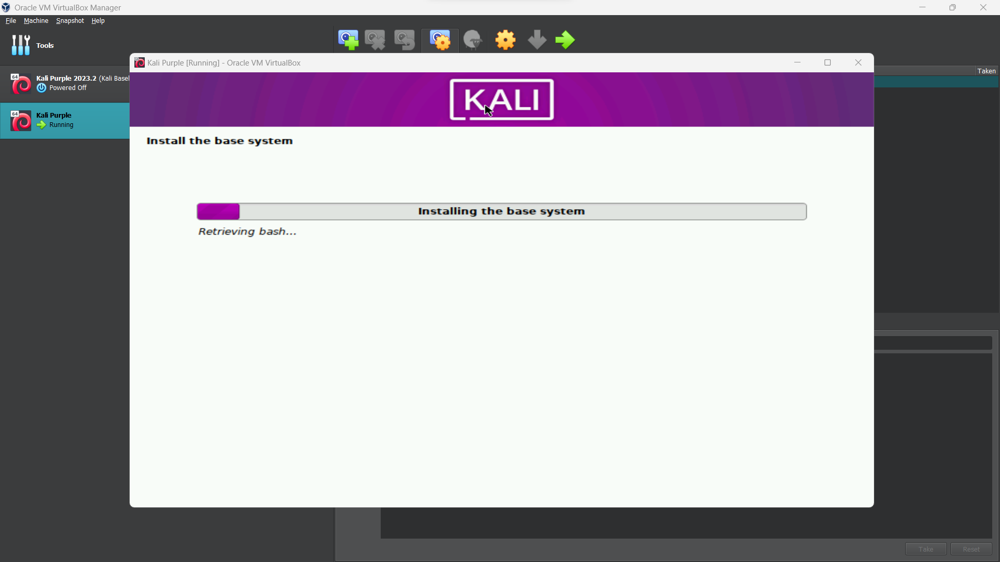
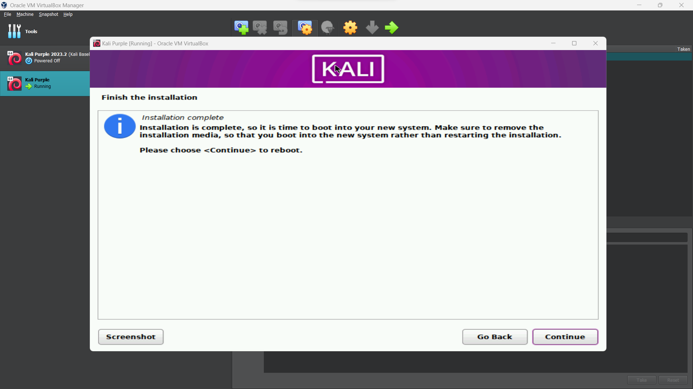
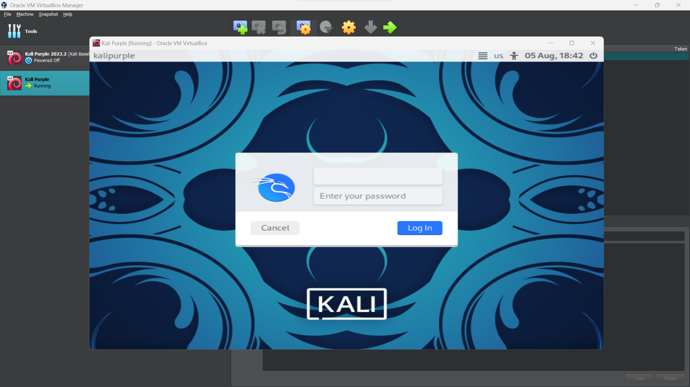

# What is Kali Purple?

Serving as an extension to the renowned Kali Linux platform, Kali Purple is an innovative cybersecurity distribution tailored specifically for defensive operations in the cyber domain. In contrast to the offensive security focus of traditional Kali Linux, Kali Purple broadens the platform's capabilities by integrating defensive tools and resources to address various facets of network defense. By leveraging the principles of the NIST Cybersecurity Framework, Kali Purple aims to empower users to proactively identify, respond to, and mitigate cybersecurity threats.

The NIST Cybersecurity Framework 1.1 comprises five core domains that provide a high-level, strategic approach to managing cyber security risk:\
\
*Identify*: Recognize the organization's assets, systems, and data, and understand the associated cyber security risks.\
*Protect*: Implement safeguards to ensure the delivery of critical infrastructure services, including access control and data security.\
*Detect*: Emphasize timely detection of cyber security events through continuous monitoring and anomaly reporting.\
*Respond*: Take appropriate actions upon detecting a cyber security event involving response planning, communication, and mitigation.\
*Recover*: Restore services and operations affected by a cyber security event, focusing on recovery planning and continuous improvement. 

## Recommended Allocations
2 GB of RAM  
20 GB of disk space

# Oracle VM VirtualBox Walkthrough
###### Navigate to https://www.kali.org/ and click "Download"
   
 ###### Select "Installer Images"
   
 ###### Navigate to and Select the recommended Kali Purple ISO for your machine
   
 ###### Open Oracle VM VirtualBox Manager and Click "New", Browse and Select the file location for your ISO
   
 ###### Modify the memory and processors to your liking (see recommended allocations above)
   
 ###### Modify the hard disk size to your liking (see recommended allocations above), Click "Finish"
   
 ###### With the VM selected, Click "Start"
   
 ###### Select "Graphical Install"
   
 ###### Select your language
   
 ###### Select your location
   
 ###### Select your keyboard layout
   
   
 ###### Choose a hostnmae for your Kali Purple VM
   
 ###### Choose a username
   
 ###### Enter a password
   
 ###### Select your timezone
   
   
 ###### Select "Guided - use entire disk"
   
 ###### Select the available disk to partition
   
 ###### Select the recommended option
   
 ###### Review your partitions and Click "Continue"
   
 ###### Choose "Yes" and Click "Continue"
   
 ###### The base system will now begin installtion
   
 ###### Leave default selections and Click "Continue"
   
 ###### Software installation will now begin
   
 ###### Choose "Yes" and Click "Continue"
   
 ###### Click "Continue"
   
 ###### The GRUB boot loader will now begin installation
   
 ###### Click "Continue"
   
   
 ###### After the installtion completes, login to your Kali Purple VM!
   
 

## Acknowledgements
https://www.stationx.net/kali-purple-guide/
https://www.kali.org/docs/virtualization/install-virtualbox-guest-vm/
