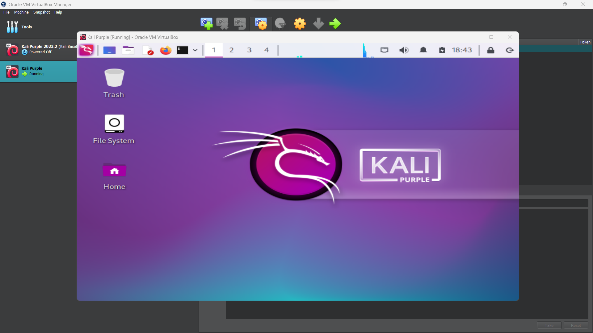

# What is Kali Purple?

Serving as an extension to the renowned Kali Linux platform, Kali Purple is an innovative cybersecurity distribution tailored specifically for defensive operations in the cyber domain. In contrast to the offensive security focus of traditional Kali Linux, Kali Purple broadens the platform's capabilities by integrating defensive tools and resources to address various facets of network defense. By leveraging the principles of the NIST Cybersecurity Framework, Kali Purple aims to empower users to proactively identify, respond to, and mitigate cybersecurity threats.

The NIST Cybersecurity Framework 1.1 comprises five core domains that provide a high-level, strategic approach to managing cyber security risk:\
\
*Identify*: Recognize the organization's assets, systems, and data, and understand the associated cyber security risks.\
*Protect*: Implement safeguards to ensure the delivery of critical infrastructure services, including access control and data security.\
*Detect*: Emphasize timely detection of cyber security events through continuous monitoring and anomaly reporting.\
*Respond*: Take appropriate actions upon detecting a cyber security event involving response planning, communication, and mitigation.\
*Recover*: Restore services and operations affected by a cyber security event, focusing on recovery planning and continuous improvement. 

## Recomended Allocations
2 GB of RAM  
20 GB of disk space

# Oracle VM VirtualBox Walkthrough

   
 
   
 
   
 
   
 
   
 
   
 
   
 
   
 
   
 
   
 
   
 
   
 
   
 
   
 
   
 
   
 
   
 
   
 
   
 
   
 
   
 
   
 
   
 
   
 
   
 
   
 
   
 
   
 
   
 
   
 
   
 
 

## Acknowledgements
https://www.stationx.net/kali-purple-guide/
https://www.kali.org/docs/virtualization/install-virtualbox-guest-vm/
