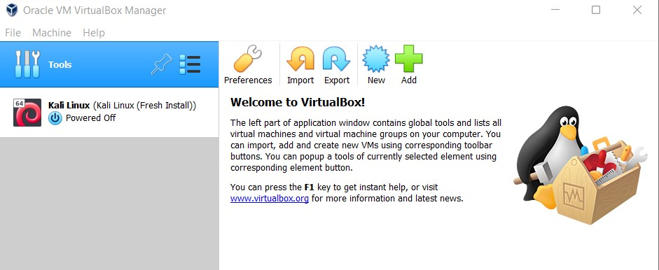
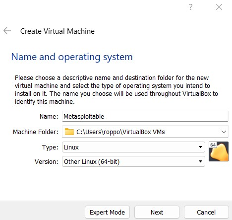
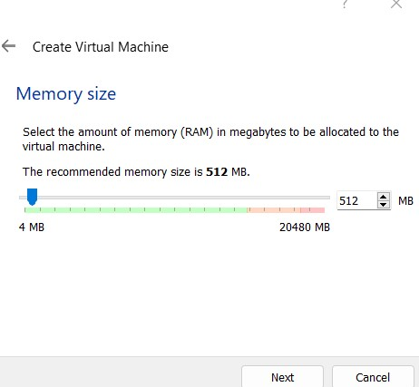
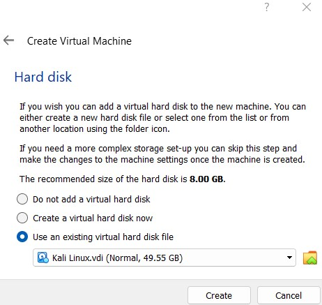
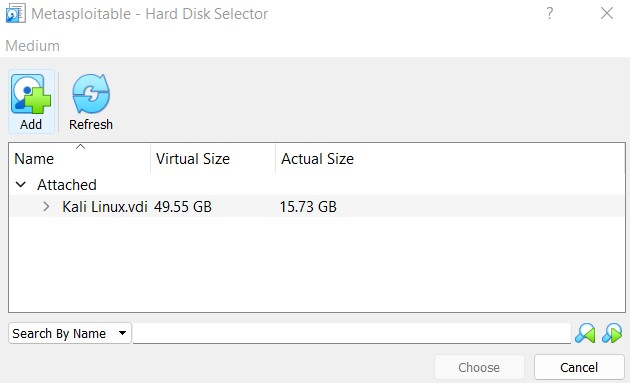
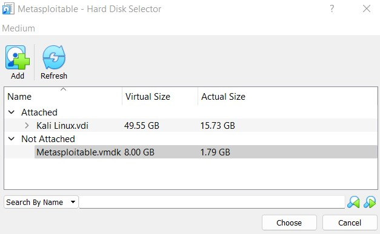
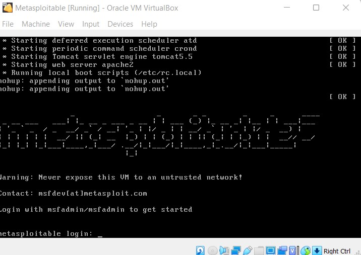

## About

In this project, I will set up a vulnerable virtual machine using Metasploitable and Oracle VM Virtual Box on Windows 11. 

## Process
#### 1) Register & Download Metasploitable 
https://information.rapid7.com/download-metasploitable-2017.html?LS=1631875&CS=web

#### 2) Open Oracle VM VirtualBox

#### 3) Click the Blue "New" Icon to create a new Virtual Machine & Fill out "Type:" and "Version:" Fields as shown below, Click "Next"

#### 4) Accept the default memory recommended size of 512 MB by Clicking "Next"

#### 5) Select "Use an existing virtual hard disk file" & Click the "Browse" Icon

#### 6) In the "Hard Disk Selector" window, Click "Add"

#### 7) Navigate to the "Metasploitable.vmdk" that you downloaded in Step 1, once it's displayed in the window, Select it and Click "Choose"

#### 8) On the "Hard Disk" window, Select "Use an existing virtual hard disk file" & Select "Metasploitable.vmdk" from the dropdown, Click "Create"

#### 9) From the VirtualBox home screen, Select the Green "Start" icon and Metasploitable will begin installing; Once finished, you will be greeted with a login screen

#### 10) Click "Enable Adapter & In the dropdown next to "Attached to:", Select "Bridged Adapter"; In the "Name" dropdown, Select your adapter (This will result in the VM being on your local network) 

