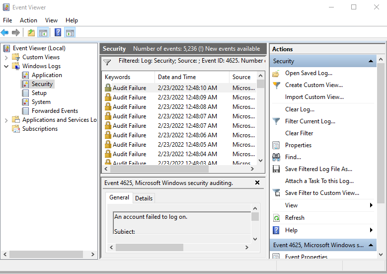
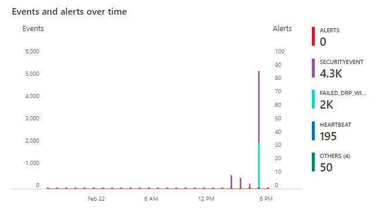
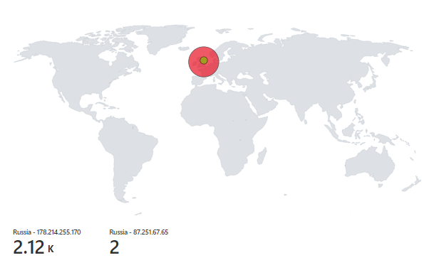
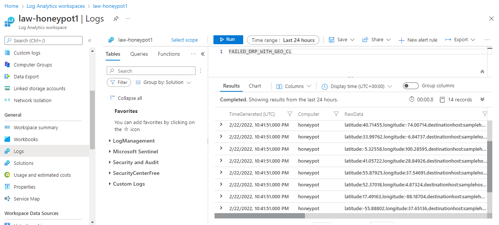
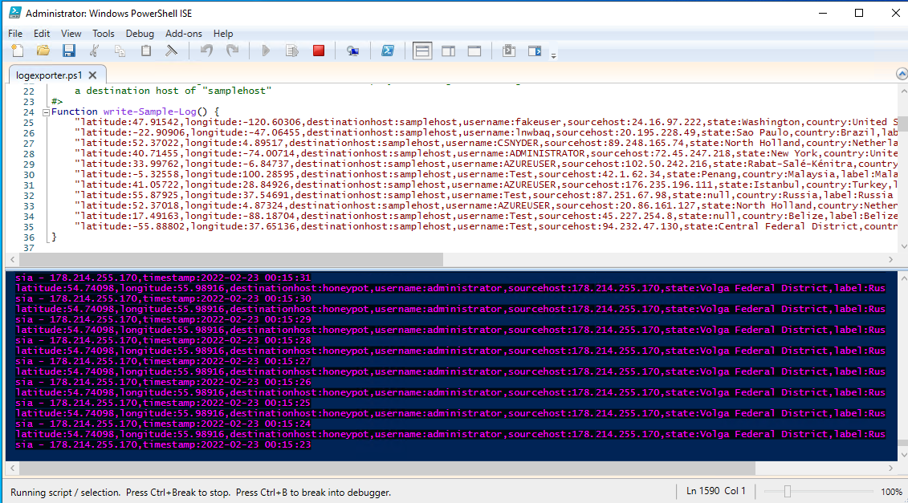
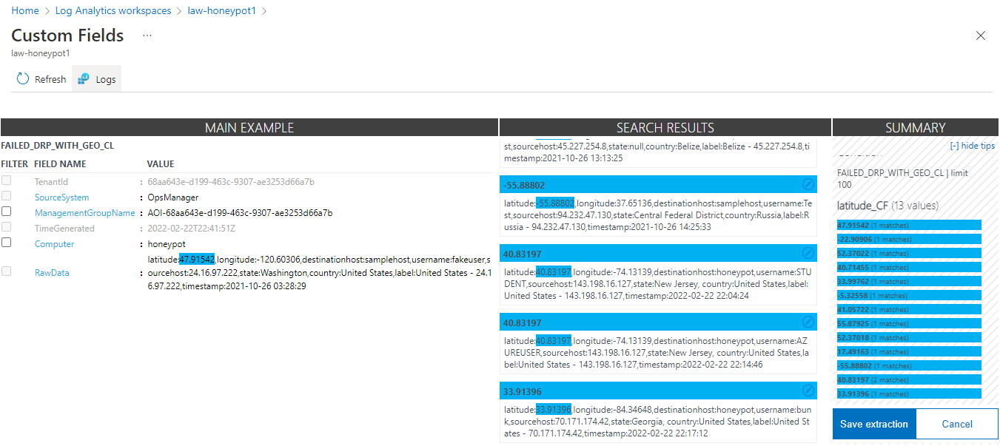
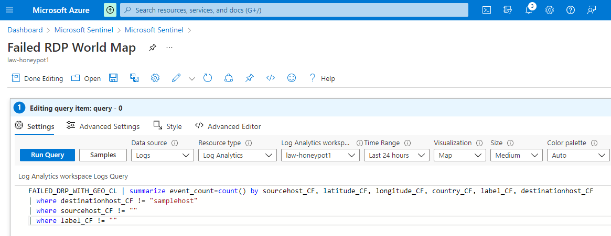

## About
In this project, using Microsoft Azure, I set up Microsoft Sentinel (SIEM) and connect it to a live virtual machine (created in Azure) which will act as a honey pot. From there, I will observe and log incoming live RDP Brute Force attacks from all around the world using a log analytics workspace in Azure. Then, using a custom PowerShell script and a geolocation.io API key, I will look up the attackers' geolocation information and plot it on the Azure Sentinel Map.

## Tools Used 
- Microsoft Azure
  - Microsoft Sentinel
  - Azure Virtual Machine
  - Azure Log Analytics Workspace
- geolocation.io
- Remote Desktop (RDP) 
- PowerShell

## Result

### Observed over 5000 brute force attacks in less than 1 hour

### Heatmap generated using log data from the Azure Log Analytics Workspace & geolocation data pulled from geolocation.io

## Process

### Creating the honeypot virtual machine in Microsoft Azure

### Setting up the Log Analytics Workspace in Microsoft Azure

### Utilizing a Powershell script to pull geolocation data from geolocation.io for failed RDP logs (To use in a heatmap in Microsoft Sentinel)

### Cleaning the log data generated from failed RDP attempts 

### Finally, running a query in Microsoft Sentinel against our data in the Log Analytics Workspace to produce the heatmap shown above

## Lessons Learned
- Within one hour of setting up this virtual machine, we observed over 5000 brute force attacks (Our 1000 free API requests from geolocation.io were gone in minutes). With that being said, malicious actors are constantly scouring the web for vulnerable machines. If nothing else, this project should reinforce the principle of **password strength & security**.

### Tips For Creating and Managing Strong Passwords (As recommended by NCCIC)
- Use multi-factor authentication when available
- Use different passwords on different systems and accounts
- Don't use passwords that are based on personal information that can be easily accessed or guessed
- Use the longest password or passphrase permissible by each password system
- Don't use words that can be found in any dictionary of any language

For more information regarding password security, see [Choosing and Protecting Passwords](https://www.cisa.gov/uscert/ncas/tips/ST04-002) and [Supplementing Passwords](https://www.cisa.gov/uscert/ncas/tips/ST05-012)

## License
This project is licensed under the MIT License - see the [LICENSE.md](https://github.com/DaveRoppo/Cyber-Security/blob/main/LICENSE) file for details

### Acknowledgements
This project was inspired by Josh Madakor's Azure Sentinel SIEM Lab 

