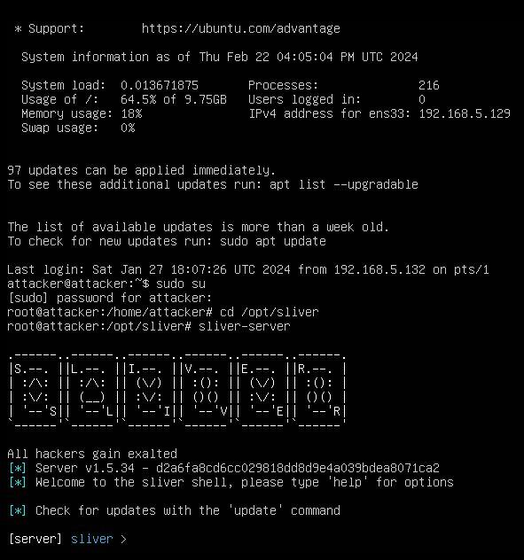
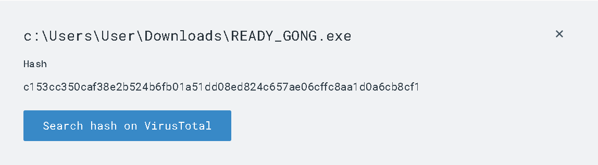
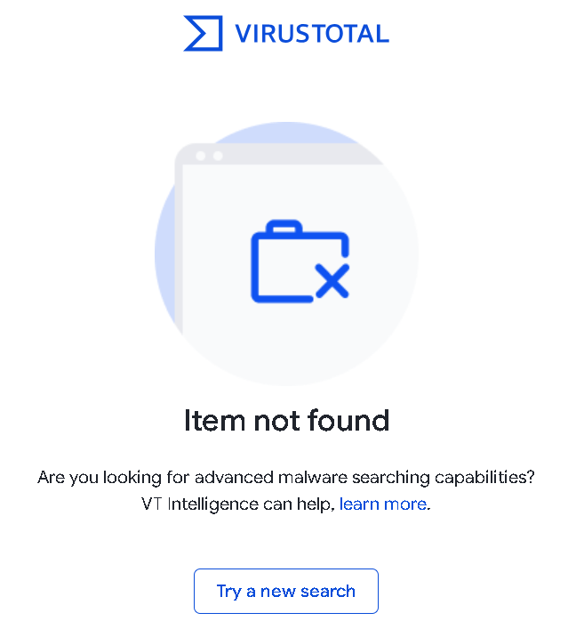
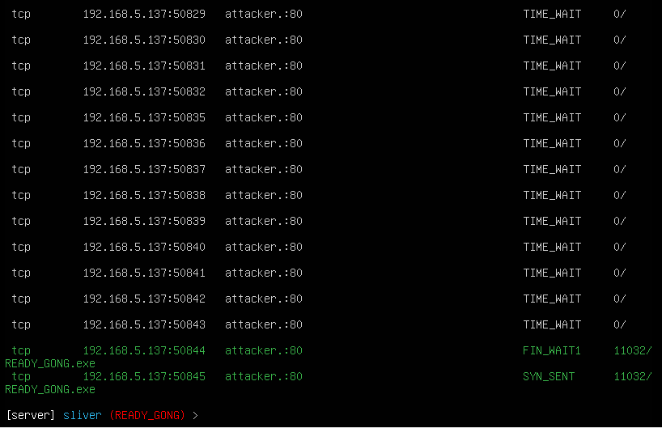
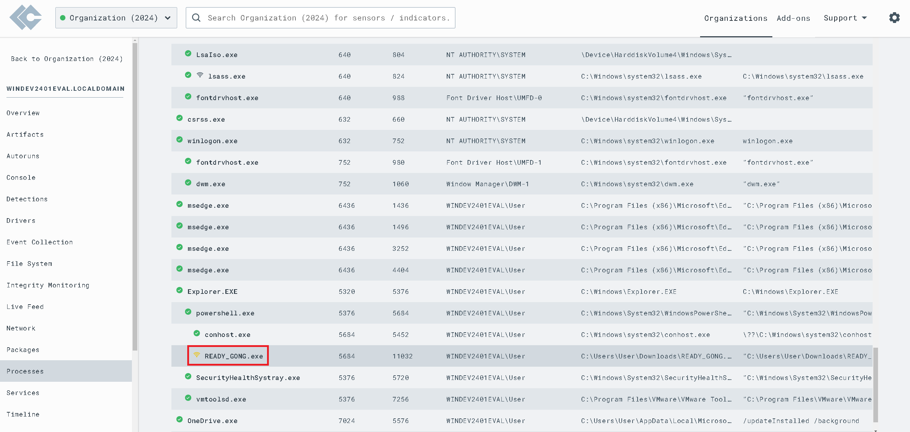
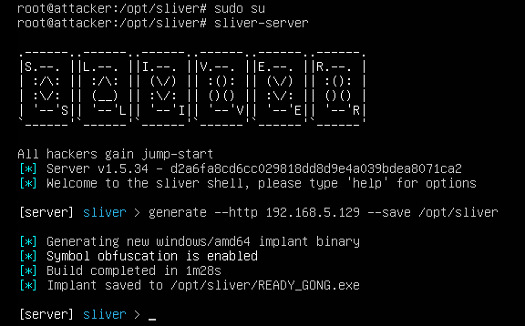

## About 
[So you want to be a SOC Analyst?](https://blog.ecapuano.com/p/so-you-want-to-be-a-soc-analyst-intro?sd=pf)

## Objectives
- Deploy and configure lab enviroment with an Ubuntu Server VM (attacker) and a vulnerable Windows 11 VM (Victim) using VMWare Workstation Pro
- Install LimaCharlie EDR agent on our victim endpoint (Windows 11)
- Generate attack telemetry using offensicve tools such as Sliver C2 on Ubuntu Server 
- Observe Windows 11 telemetry in LimaCharlie EDR web interface
- Craft and tune detection & response rules to alert on and respond to malicious activity

## Lab Environment 
- VMWare Workstation Pro
- Ubuntu Server 22.04.1 (Attacker) 14GB Disk size 2 CPU cores 2GB RAM
- Windows 11 Eval (Victim)
## Tools Used
### Offensive Toolset
- Sliver
### Defensive Toolset
- LimaCharlie EDR
- Sigma
- Sysmon
- Yara
#### Threat Intelligence
- EchoTrail
- VirusTotal
- Mitre ATT&CK

## Actions

  
  
  
  
  
  
  
  
  
  
  
  
  
  
  
  
  
  
  
  
  
  
  
  
  
  
  
  
  
  
  
  
  
  
  
  
  
  
  
  
  
  
  
  
  
  
  
  
  
  

