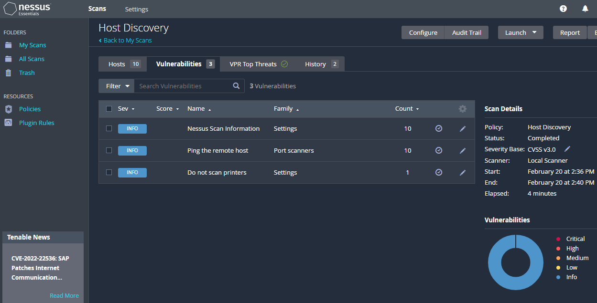
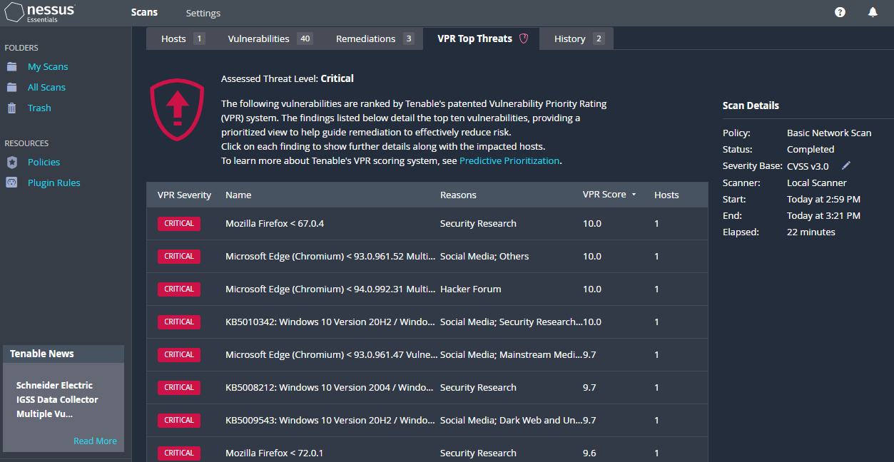
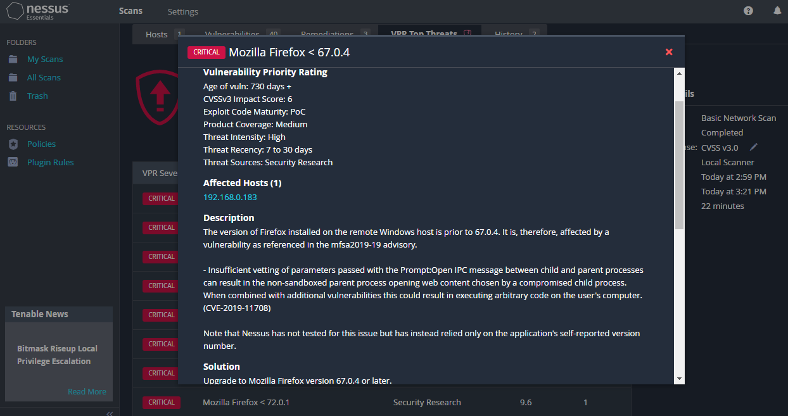
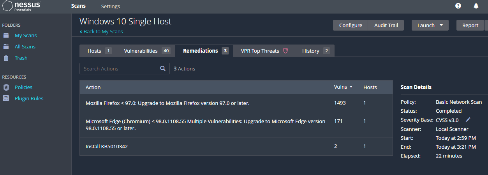

## About
In this project, I display the Vulnerability Management Lifecycle by using Nessus Essentials to scan local Windows 10 virtual machines hosted on VMware Workstation 16 Player to discover and remediate vulnerabilities. 

### Tools Used
  - VMware Workstation 16 Player (Windows 10 Virtual Machine)
  - Nessus Essentials (Vulnerability Scanner)

### Result
- After performing a credentialed scan on the local Windows 10 virtual machine, 156 Critical (68) and High (88) vulnerabilities were discovered. Following remediation, another credentialed scan was performed resuting in 0 Crtical and High vulnerabilities.

### Initial Discovery Scan

### Post-Remediation Scan

 
  
# Vulnerability Management Lifecycle (Tenable)
1. **Discover** - Identify and map every asset across all of your computing environments
2. **Assess** - Evaluate the cyber exposure of all of your assets, including vulnerabilities, misconfigurations and other security health indicators
3. **Analyze** - Understand your exposures in context to your security and business goals so you can prioritize remediation based on:
    - Asset criticality
    - Threat context
    - Vulnerability severity
4. **Mitigate** - Prioritize which exposures to mitigate first, if at all, and then apply the appropriate remediation process

## 1. Discover
Host discovery scan to identify assets:

## 2. Assess
Credentialed Scan to evaluate the cyber exposure (vulnerabilities, misconfigurations, health) of assets:

## 3. Analyze
Analyze results in context to your goals to prioritize remediation based on asset criticality, threat context and vulnerability severity:

## 4. Mitigate
Prioritize which exposures to mitigate first, if at all, and then apply the appropriate remediation process. Finally, run another vulnerabilty scan to verify remediation:

### Acknowledgements
This project was inspired by Josh Madakor's Vulnerability Managment Lab 
    
  
