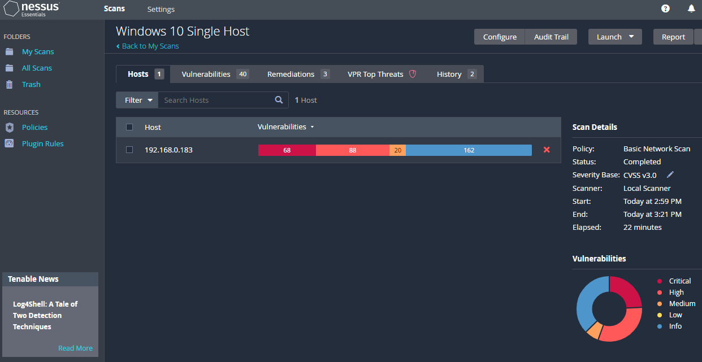
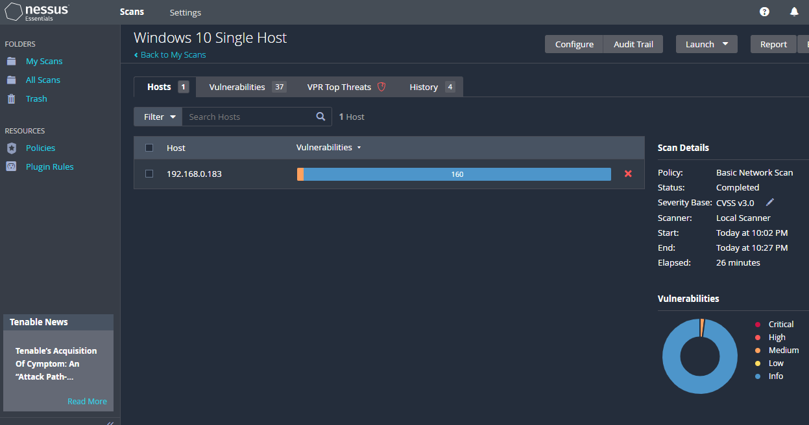

## About
In this project, I display the Vulnerability Management Lifecycle by using Nessus Essentials to scan local Windows 10 virtual machines hosted on VMware Workstation 16 Player to discover and remediate vulnerabilities. 

### Tools Used
  - VMware Workstation 16 Player (Windows 10 Virtual Machine)
  - Nessus Essentials (Vulnerability Scanner)

### Result
- After performing a credentialed scan on the local Windows 10 virtual machine, 156 Critical (68) and High (88) vulnerabilities were discovered. Following remediation, another credentialed scan was performed resuting in 0 Crtical and High vulnerabilities.

### Initial Discovery Scan

### Post-Remediation Scan

 
  
# Vulnerability Management Lifecycle (Tenable)
1. Discover
2. Assess
3. Analyze
4. Mitigate
5. Measure

## 1. Discover

## 2. Assess

## 3. Analyze

## 4. Mitigate

## 5. Measure

    
  
