# About
A Malware traffic analysis exercise from a pcap posted on Malware-Traffic-Analysis.net on 2019-11-12 by Brad Duncan.
## SCENARIO
### LAN segment data:

LAN segment range:  10.11.11.0/24 (10.11.11.0 through 10.11.11.255) \
Domain:  okay-boomer.info \
Domain controller:  10.11.11.11 - Okay-Boomer-DC \
LAN segment gateway:  10.11.11.1 \
LAN segment broadcast address:  10.11.11.255
 

## QUESTIONS

### What operating system and type of device is on 10.11.11.94?
 Operating System: ChromeOS \
 Device Type: Chromebook
 
 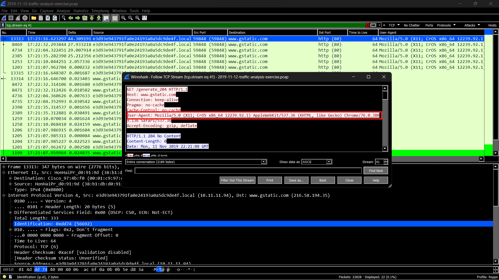
### What operating system and type of device is on 10.11.11.121?
 Operating System: Android 9
 Device Type: Samsung Galaxy Note 8
 
 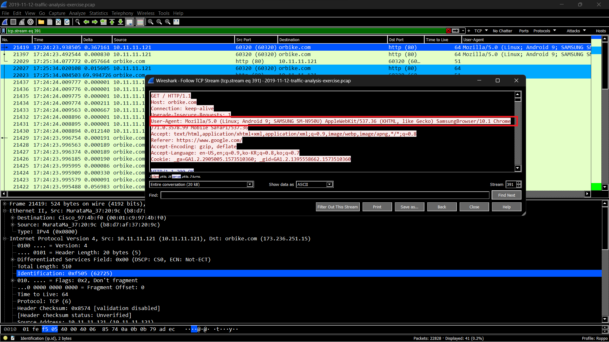\
 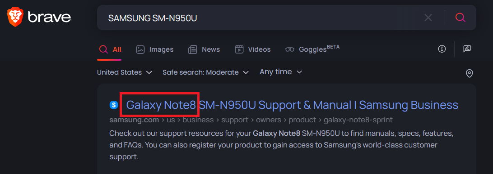
### Based on the MAC address for 10.11.11.145, who is the manufacturer or vendor?
 Motorola

 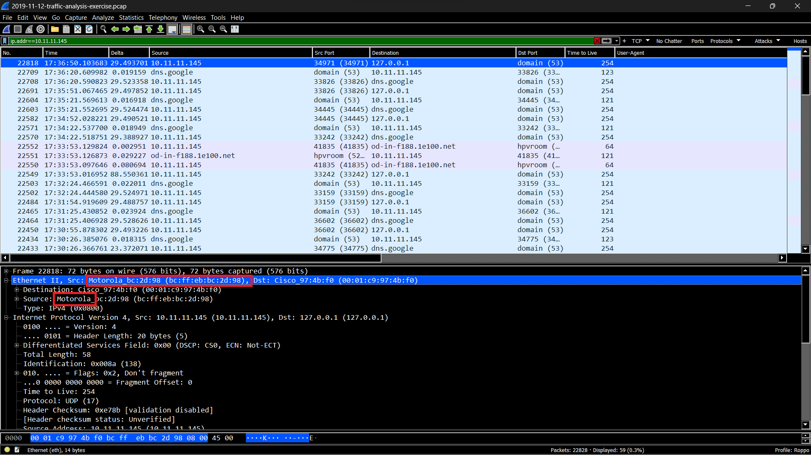
### What operating system and type of device is on 10.11.11.179?
 macOS 10.15.1 (Catalina) on a Mac

 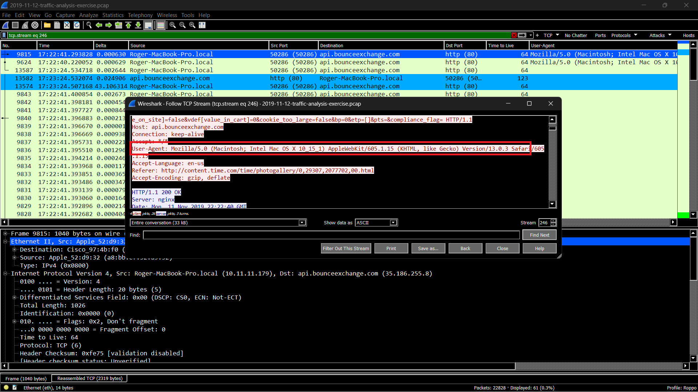
### What version of Windows is being used on the host at 10.11.11.195?
 Windows 10 

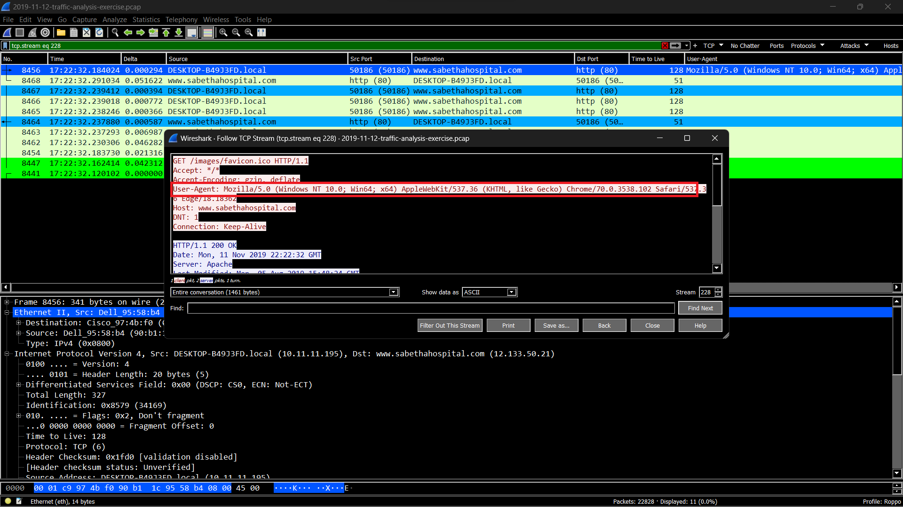
### What is the user account name used to log into the Windows host at 10.11.11.200?
 brandon.gilbert

 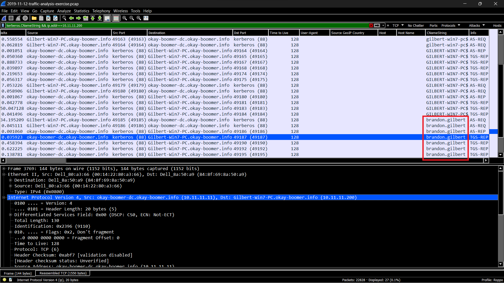
#### What operating system and type of device is on 10.11.11.217?
  iPadOS 13.2.2 on an iPad

 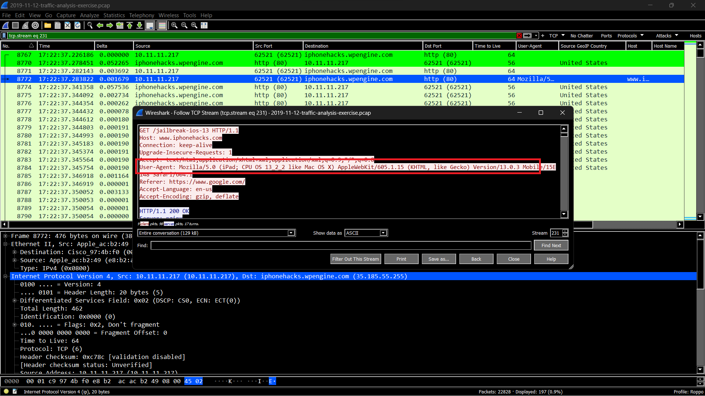
### What IP is the Windows host that downloaded a Windows executable file over HTTP?
 10.11.11.203 - We found this information by using the filter (ip contains "This program"). We did this because it is common for EXE and DLL files to contain the line "This program cannot be run in DOS mode." Also, the first two bites of EXE or DLL files show as MZ in ASCII.

 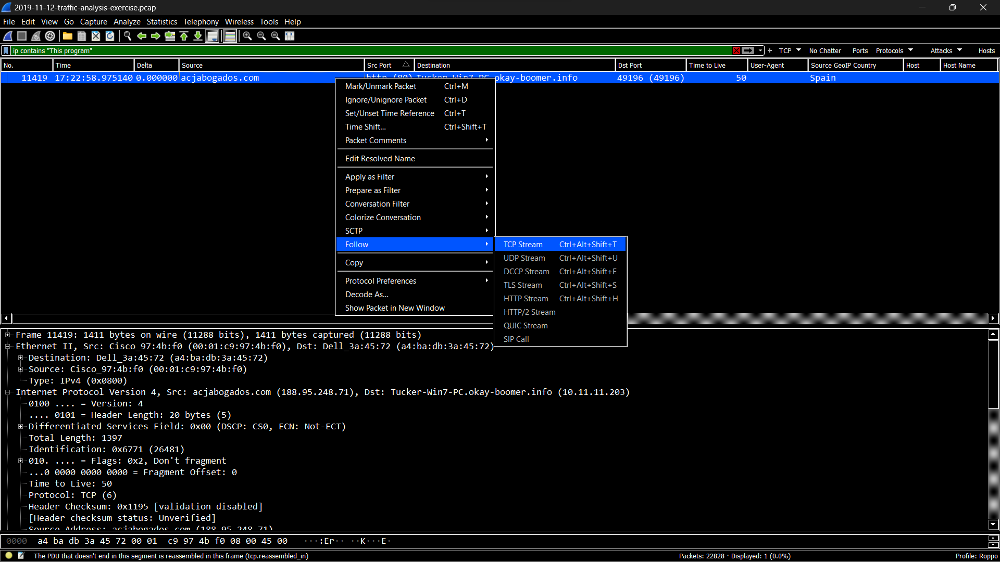\
 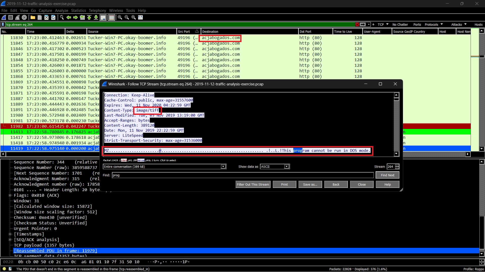
### What is the URL that returned the Windows executable file?
 http://acjabogados.com/40group.tiff

 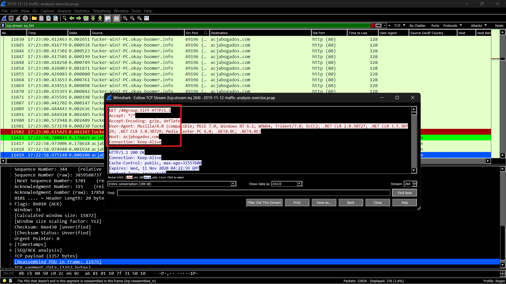\
  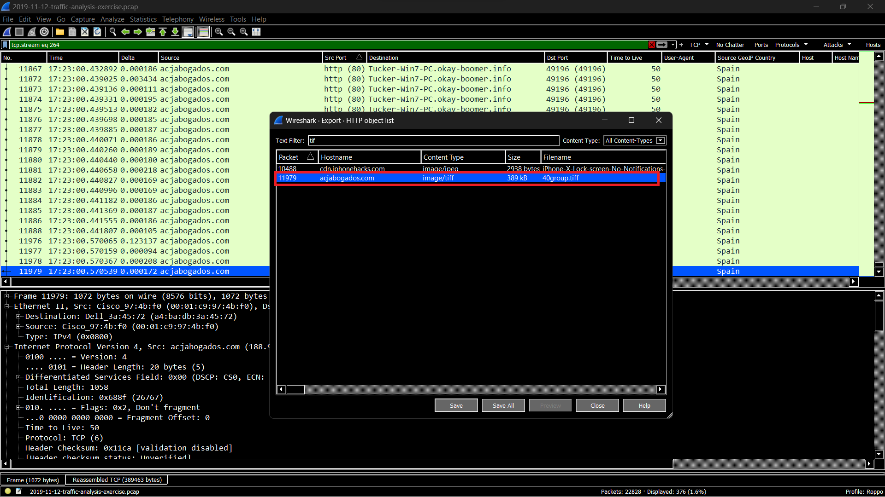
### What is the SHA256 file hash for that Windows executable file?
 8d5d36c8ffb0a9c81b145aa40c1ff3475702fb0b5f9e08e0577bdc405087e635

#### What is the detection rate for that SHA256 hash on VirusTotal?
 61/71

 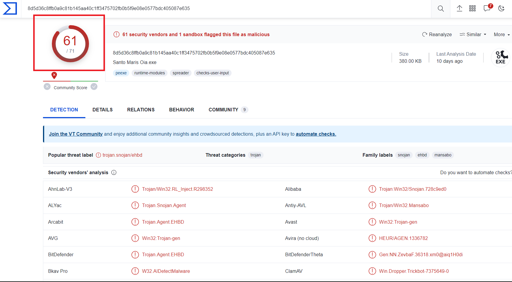
### What public IP addresses did that Windows host attempt to connect over TCP after the executable file was downloaded?
 5.188.108.58 and 138.201.6.195

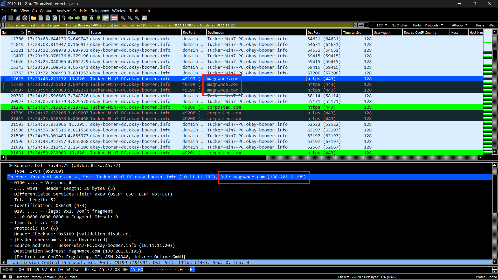\
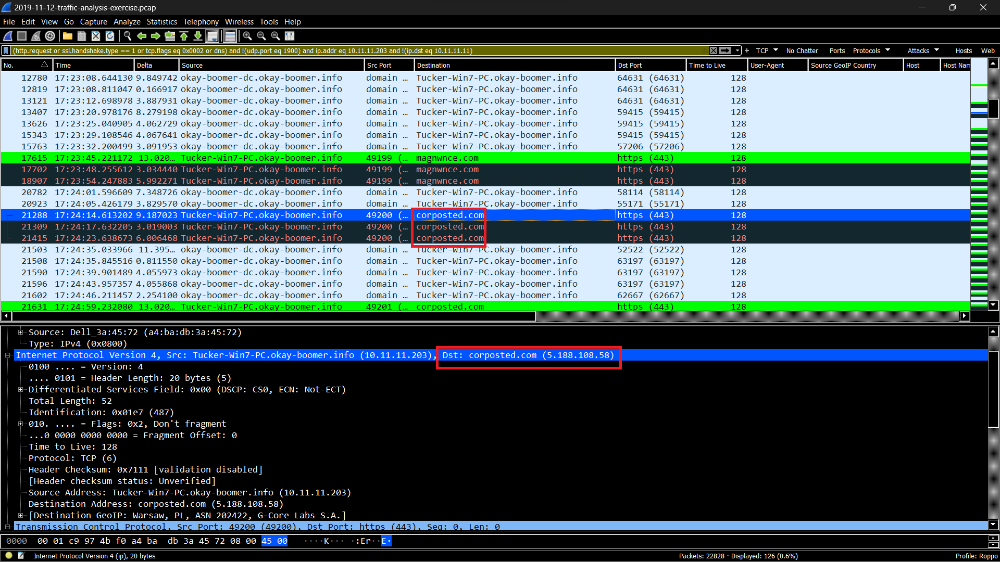
### What is the host name and Windows user account name used on that IP address?
host name: Tucker-Win7-PC , user account name: candice.tucker

 ### Acknowledgements
A Malware traffic analysis exercise from a pcap posted on Malware-Traffic-Analysis.net on 2019-11-12 by Brad Duncan.
