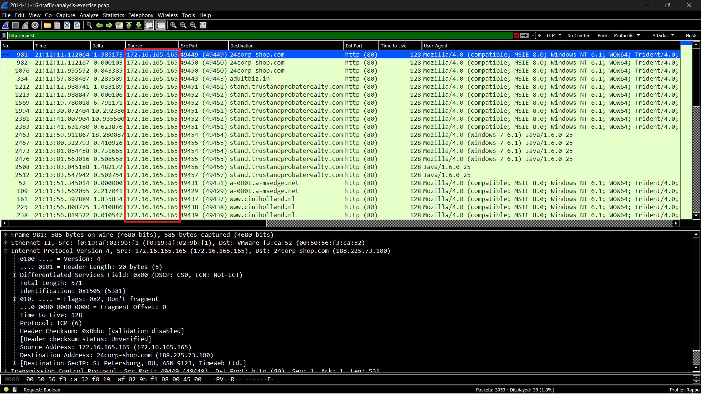

# QUESTIONS
## LEVEL 1 QUESTIONS:
#### 1) What is the IP address of the Windows VM that gets infected? 
 172.16.165.165
 
#### 2) What is the host name of the Windows VM that gets infected?
 K34EN6W3N-PC
#### 3) What is the MAC address of the infected VM?
 f0:19:af:02:9b:f1
#### 4) What is the IP address of the compromised web site?
 82.150.140.30
#### 5) What is the domain name of the compromised web site?
 www.ciniholland.nl
#### 6) What is the IP address and domain name that delivered the exploit kit and malware?
 37.200.69.143
#### 7) What is the domain name that delivered the exploit kit and malware?
 stand.trustandprobaterealty.com

## LEVEL 2 QUESTIONS:
#### 1) What is the redirect URL that points to the exploit kit (EK) landing page?
 http://24corp-shop.com/
#### 2) Besides the landing page (which contains the CVE-2013-2551 IE exploit), what other exploit(s) sent by the EK?
 x-shockwave-flash and java-archive
#### 4) How many times was the payload delivered?
 3
#### 5) Submit the pcap to VirusTotal and find out what snort alerts triggered.  What are the EK names are shown in the Suricata alerts?
ET CURRENT_EVENTS Cool/BHEK/Goon Applet with Alpha-Numeric Encoded HTML entity [2017064]
ET CURRENT_EVENTS GoonEK encrypted binary (3) [2018297]
ET CURRENT_EVENTS Goon/Infinity URI Struct EK Landing May 05 2014 [2018441]
ET CURRENT_EVENTS RIG EK Landing URI Struct [2019072]
ET CURRENT_EVENTS RIG EK Landing Page Sept 17 2014 [2019193]
ET CURRENT_EVENTS RIG EK Landing March 20 2015 M2 [2020726]
ET CURRENT_EVENTS Possible IE MSMXL Detection of Local SYS (Likely Malicious) [2021430]

## LEVEL 3 QUESTIONS:
#### 1) Checking my website, what have I (and others) been calling this exploit kit?
 Rig EK
#### 2) What file or page from the compromised website has the malicious script with the URL for the redirect?
 
#### 3) Extract the exploit file(s).  What is(are) the md5 file hash(es)?

#### 4) VirusTotal doesn't show all the VRT rules under the "Snort alerts" section for the pcap analysis.  If you run your own version of Snort with the VRT ruleset as a registered user (or a subscriber), what VRT rules fire?

